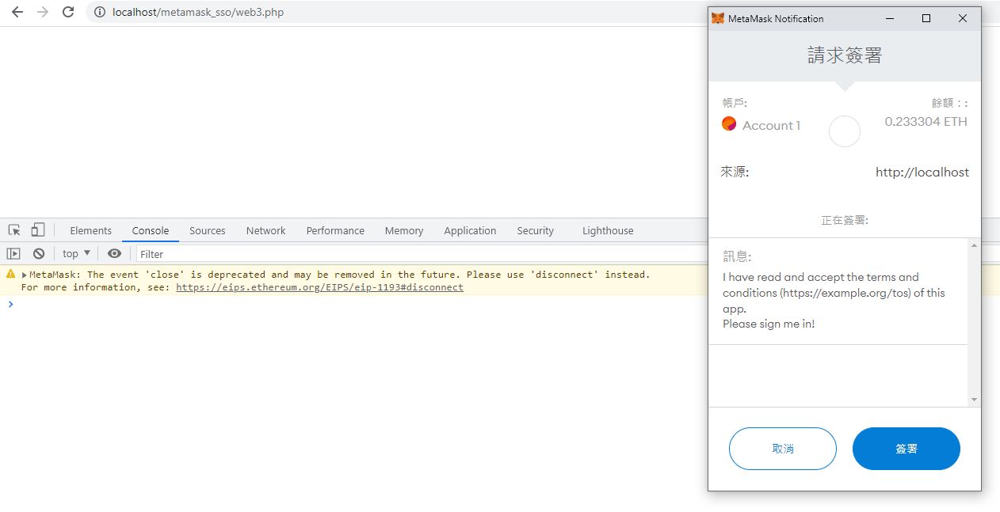

# Metamask SSO (Single-Sign-On) using PHP

This piece of code remove almost all the unimportant stuff (like laravel and react) and straight to the very core of how Metamask SSO works.

## Requirements:
- I am using PHP 8.0.8.  But I don't think it matters much when you can run below libraries.
- PHP Composer (Latest)
  - Keccak - https://github.com/kornrunner/php-keccak
  - Fast Elliptic Curve - https://github.com/simplito/elliptic-php

  - You install the above 2 libraries by below command line:
    - `composer require kornrunner/keccak --ignore-platform-reqs`
    - `composer require simplito/elliptic-php --ignore-platform-reqs`
- Web3.js (CDN Version).  Find the imported version if you want to use it under modern JS environment.

## Logic behind Metamask SSO - Read web3.php

1. Check if `window.ethereum` exists, i.e. if Metamask is installed in current browser
2. We need 3 things to make this work
    - `message`: The message displayed in Metamask window (also known as "nonce")
    - `address`: Metamask wallet address
    - `signature`: Hashed "signature" after user clicks on the big blue "Sign" button (as of 15/12/2021)
4. To get `address`, we use `web3.eth.requestAccounts()` and get the first array item.
5. To get `signature`, we use `web3.eth.personal.sign()` function and pass in the `message` and `address` you got from above steps
6. Check if `address` is the same as public key address (generated by `message`, `address` and `signature`).
7. If they are identical, it is a success.

## Result

References:
- https://www.quicknode.com/guides/web3-sdks/how-to-build-a-one-click-sign-in-using-metamask-with-php-s-laravel
- https://www.frank.hk/blog/smart-contract-mystery-box/
